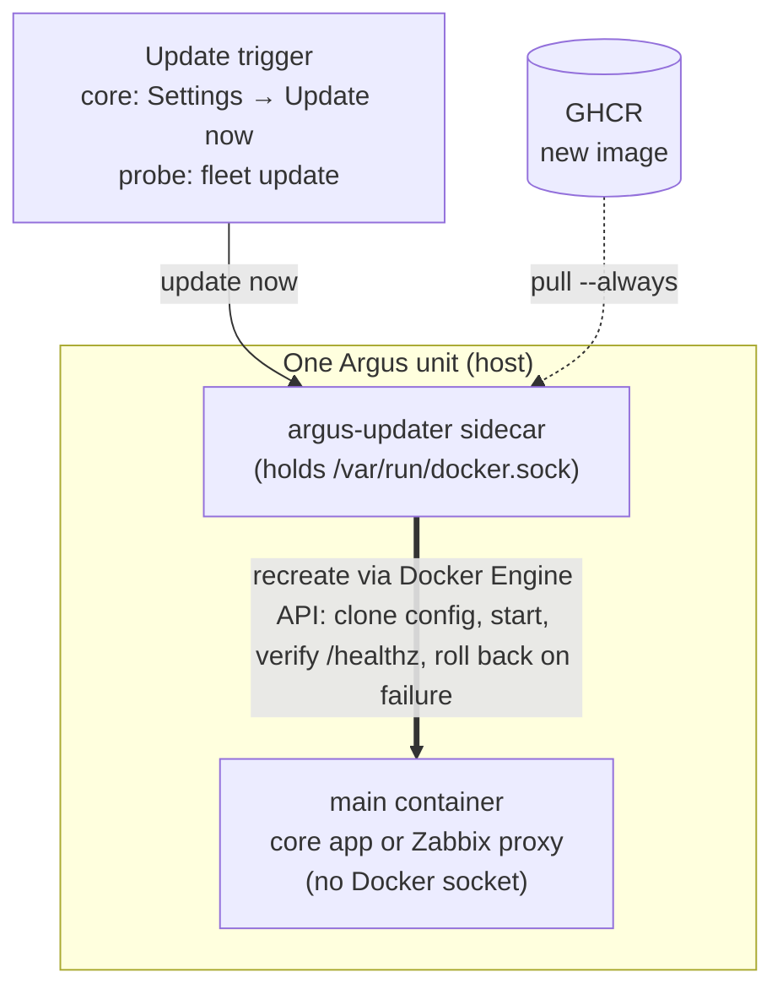

<p align="center"></p>

# argus-updater

The shared self-update sidecar for [Argus](https://github.com/g-guglielmi/argus-core). One small
socket-holding container that recreates a target container on a new image - pull → verify the
pulled digest against the one Argus handed out with the tag → recreate cloning the running config →
health-verify → roll back on failure - used by **both** the core and the
[argus-probe](https://github.com/g-guglielmi/argus-probe) proxies, so the public-facing core (and the
outbound-only probes) never need to hold the Docker socket themselves.

- **`deploy/updater/`** - the `argus-updater` image (`ghcr.io/g-guglielmi/argus-updater`): the shared
  recreate engine (`lib/recreate.sh`), the per-mode scripts (`modes/`), and a compose example.

## How it works

Every Argus-managed unit runs as **two containers**: the **main** container (the core app, or a
Zabbix proxy) is a pure reporter with **no access to the Docker socket**, and a small
**argus-updater** sidecar holds the socket and performs the recreate on its behalf - so the
public-facing core and the outbound-only probes never expose the Docker socket themselves.



The sidecar updates **itself** the same way - it spawns a throwaway `probe-recreate` copy (see the
mode below) that recreates it and exits. In the `core` mode both write each step of that self-update
to `updater-status.json` in the shared dir, and every core update keeps its steps in `status.json`,
so the core's Settings page shows what an update is doing until it ends.

## Modes

One image, picked with `ARGUS_UPDATER_MODE` (default `core`, so an existing core sidecar that sets no
mode keeps working unchanged). The recreate engine is shared, so the paths can never drift.

| Mode | Lifetime | What it does |
|------|----------|--------------|
| `core` *(default)* | long-running | Watch the shared `/update` dir; recreate the **core** when an admin clicks **Settings → Update now**. `/healthz`-aware; preserves the release channel (`:latest`/`:testing`). Also keeps the core host's **collectors** current (below). |
| `probe-watch` | long-running | **The probe updater** (run / compose / VM). A socket-holding sidecar that recreates the proxy via the Engine API on a dashboard "Update now" or a target change - so the **proxy stays socket-free**, same as the core. Restarts the proxy when Argus changes its Zabbix process counts (read only at start). Also updates **itself** on request via the primitive below. |
| `probe-recreate` | one-shot | Recreate a target container on a new image, then exit. The self-update **primitive**: a long-running updater spawns an ephemeral `--rm` copy of itself in this mode to recreate itself. |

Every mode recreates via the **Docker Engine API** (no `docker compose` dependency). The `core` mode
is triggered from the core's **Settings → update** flow; `probe-watch` is driven by Argus fleet
updates (see the argus-probe / argus-core repos).

**Container health.** The image declares a Docker `HEALTHCHECK` (`/app/healthcheck.sh`): the
Engine must answer on the socket, and in the long-running modes the watch loop must keep going round
(each round writes `/tmp/argus-updater.heartbeat` with how long the next may take, an update
included). `docker ps`, the Unraid GUI and Dockhand show the result.

**The core host's collectors.** The core's Zabbix server is a host package, not a container, so the
collectors (external checks) it runs for the hosts it monitors live in the host's
`/usr/lib/zabbix/externalscripts` and no image update reaches them. The Argus image carries them, so
the `core` mode installs them: whenever the core's image changes (an update, a redeploy), and again a
day later to put back a deleted or edited one, it runs that same image once - as root, with no network
and only that folder bound in - and `/argus install-collectors` writes the collectors that changed.
The outcome shows in the core under **Settings → About → Collectors**. Nothing to run by hand; a
host whose Zabbix server runs elsewhere has no such folder and is skipped. `ARGUS_COLLECTORS_DIR`
points it at another folder.

**probe-watch** - run one alongside each proxy (the proxy needs **no** socket):

```bash
docker run -d --name <proxy>-updater --restart unless-stopped \
  -v /var/run/docker.sock:/var/run/docker.sock \
  -v <proxy-data-dir>:/probe:ro \
  -e ARGUS_UPDATER_MODE=probe-watch \
  -e ARGUS_PROXY_CONTAINER=<proxy-container-name> \
  ghcr.io/g-guglielmi/argus-updater:latest
```

**Versioning:** a rolling `:latest` (tracks `main`) plus version-pinned images (`:X.Y.Z`, `:X.Y`) and a GitHub Release cut from each `vX.Y.Z` tag - pin a version in production if you'd rather not track `:latest`. What changed in each release is in [CHANGELOG.md](CHANGELOG.md), which also feeds the Release notes (add the version's section before tagging - the tag build fails without it).

## Related

- **[argus-core](https://github.com/g-guglielmi/argus-core)** - the app it updates.
- **[argus-probe](https://github.com/g-guglielmi/argus-probe)** - the monitoring probe (image + VM) whose proxies it also updates.

## License

Argus is free software licensed under the **GNU Affero General Public License v3.0**
(see [`LICENSE`](LICENSE)). Source: <https://github.com/g-guglielmi/argus-updater>

Copyright (C) 2026 g-guglielmi
